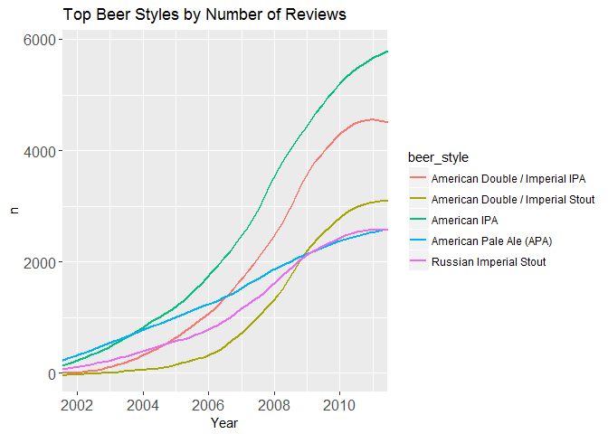
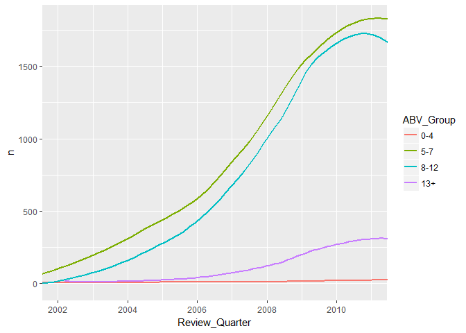
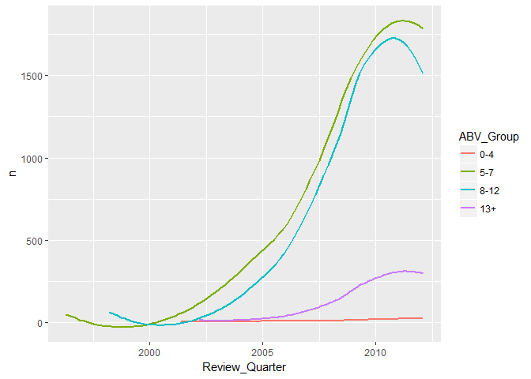
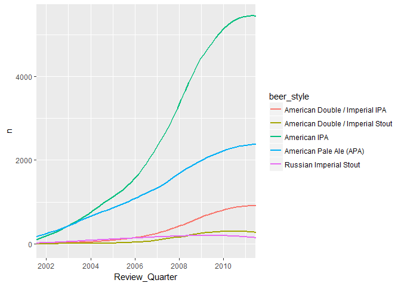
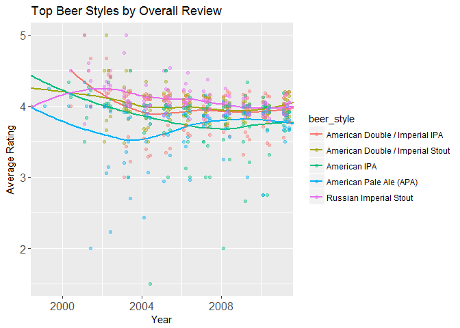
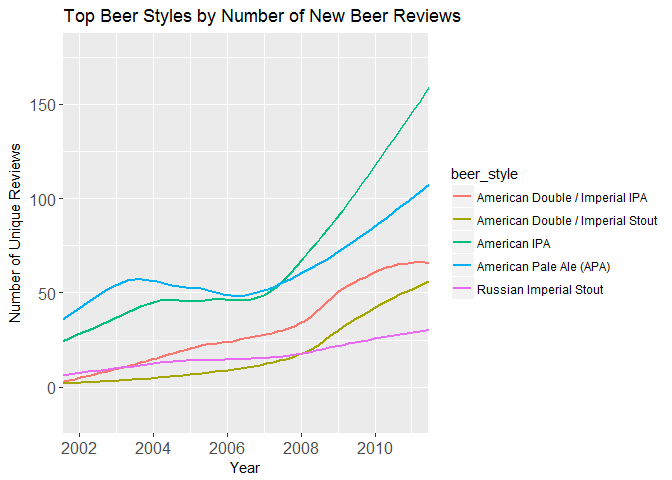
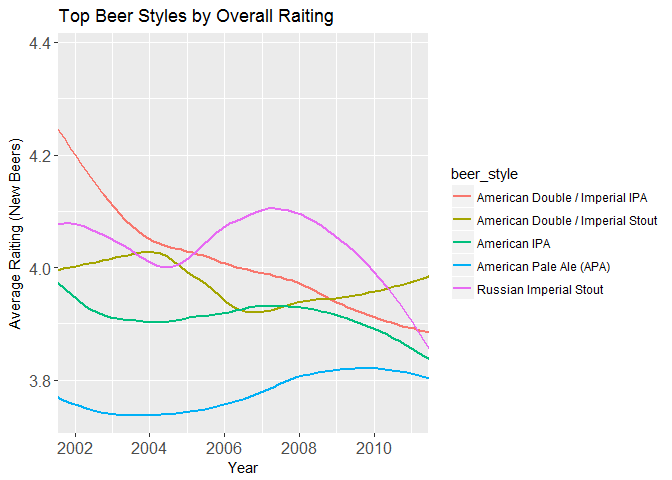
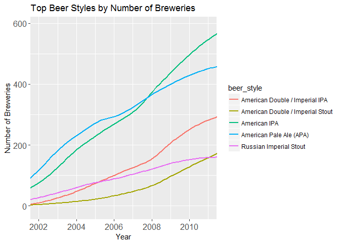

# BeerAdv
Seth_Raithel  
June 30, 2017  


### Comparing Number of Review by Year and Style
The first thing we notice is that IPA's (Both regular and Double) have seen a massive increase in number of review compared to other styles.  The second thing we notice is the 2nd and 3rd highest are Double (higher alcohol beers).

```r
beer_trend<-beer %>% filter(beer_style %in% beer_styles_top5$beer_style) %>% count(Review_Quarter,beer_style)
beer_top_q<-beer %>% filter(beer_style %in% beer_styles_top5$beer_style) %>% group_by(Review_Quarter,beer_style,beer_name) %>%  summarise(n=n(),"Avg.Raiting"=round(mean(review_overall),1))%>% group_by(Review_Quarter,beer_style) %>% top_n(1,wt=n) %>% distinct(Review_Quarter,beer_style,.keep_all=TRUE)

names(beer_top_q)<-c("Review_Quarter","beer_style","beer_name","Number_Reviews","Average_Review")

beer_trend<-left_join(beer_trend,beer_top_q)
```

```
## Joining, by = c("Review_Quarter", "beer_style")
```

```r
#plot number of reviews by year/quater
ggplot(data=beer_trend,aes(x=Review_Quarter,y=n,color=beer_style))+geom_smooth(se=FALSE,method="loess")+coord_cartesian(xlim=c(2002,2011))+ggtitle("Top Beer Styles by Number of Reviews")+xlab("Year")+theme(axis.text.x = element_text(size = 12),axis.text.y = element_text(size=12))
```

<!-- -->

### Comparing Number of Reviews by ABV

```r
#create abv grouping
#what is typical?
fivenum(beer$beer_abv)
```

```
## [1]  0.01  5.20  6.50  8.50 57.70
```

```r
#most are between 5 and 8, with some crazy high beers at 57%


beer_abv<-beer %>% count(Review_Quarter,ABV_Group,beer_style) %>% filter(beer_style %in% beer_styles_top5$beer_style) %>% filter(!is.na(ABV_Group))

levels(beer_abv$ABV_Group)<-c("0-4","5-7","8-12","13+")

ggplot(data=beer_abv,aes(x=Review_Quarter,y=n,color=ABV_Group))+geom_smooth(se=FALSE)+coord_cartesian(xlim=c(2002,2011))
```

```
## `geom_smooth()` using method = 'loess'
```

<!-- -->
### Split ABV by Top Styles


```r
ggplot(data=beer_abv,aes(x=Review_Quarter,y=n,color=ABV_Group))+geom_smooth(se=FALSE)
```

```
## `geom_smooth()` using method = 'loess'
```

<!-- -->

```r
#Double typically 8+
#single typlically 5-7
ggplot(data=beer_abv %>% filter(ABV_Group=="5-7"),aes(x=Review_Quarter,y=n,color=beer_style))+geom_smooth(se=FALSE)+coord_cartesian(xlim=c(2002,2011))
```

```
## `geom_smooth()` using method = 'loess'
```

<!-- -->

### Ratings
Each beer is given a rating by the user based on 4 characteristic:

 * Taste
 * Aroma
 * Palate
 * Appearance

Here we are just going to focus on the overall rating to see how the average rating has changed over time.
Interstingly enough, almost all the beer styles start out with higher ratings (and a lot more variability) and gradually flatten out to around 4.0 out of 5. American IPA's show a slight downturn, where as the Double IPA is show a slight uptick in the last few quarters. The ratings are likely getting saturated by a large number of medicore beers rather than an actual decline of quality of the beer itself.


```r
beer_review<-beer %>% filter(beer_style %in% beer_styles_top5$beer_style) %>% group_by(Review_Quarter,beer_style,ABV_Group) %>% summarise("Avg.Raiting"=mean(review_overall)) %>% filter(!is.na(ABV_Group))

beer_brewery<-beer %>% filter(beer_style %in% beer_styles_top5$beer_style) %>% group_by(Review_Quarter,beer_style,brewery_name) %>% summarise("n"=n()) %>% count(Review_Quarter,beer_style)

beer_beer<-beer %>% filter(beer_style %in% beer_styles_top5$beer_style) %>% group_by(Review_Quarter,beer_style,beer_name) %>% summarise("n"=n()) %>% count(Review_Quarter,beer_style)


unqiue.reviews<-beer %>% filter(beer_style %in% beer_styles_top5$beer_style) %>% group_by(Review_Quarter,beer_style,beer_name) %>% count() %>%group_by(beer_name) %>%  mutate("First.Review"=min(Review_Quarter)) %>% filter(Review_Quarter==First.Review) %>% ungroup() %>% count(Review_Quarter,beer_style)

unqiue.reviews.avg<-beer %>% filter(beer_style %in% beer_styles_top5$beer_style) %>% group_by(Review_Quarter,beer_style,beer_name) %>% summarise("avg.rate"=mean(review_overall)) %>%group_by(beer_name) %>%  mutate("First.Review"=min(Review_Quarter)) %>% filter(Review_Quarter==First.Review) %>% ungroup() %>% group_by(Review_Quarter,beer_style) %>% summarise("avg.rate"=mean(avg.rate),n=n())

#main rating over time plot
ggplot(data=beer_review,aes(x=Review_Quarter,y=Avg.Raiting,color=beer_style))+geom_smooth(method="loess",se=FALSE)+geom_point(alpha=0.4)+coord_cartesian(xlim=c(1999,2011))+ggtitle("Top Beer Styles by Overall Review")+xlab("Year")+ylab("Average Rating")+theme(axis.text.x = element_text(size = 12),axis.text.y = element_text(size=12))
```

<!-- -->

```r
#IPA show'd largest number of 'new' beers
ggplot(data=unqiue.reviews,aes(x=Review_Quarter,y=nn,color=beer_style))+geom_smooth(se=FALSE,method="loess")+coord_cartesian(xlim=c(2002,2011))+ggtitle("Top Beer Styles by Number of New Beer Reviews")+ylab("Number of Unique Reviews")+xlab("Year")+theme(axis.text.x = element_text(size = 12),axis.text.y = element_text(size=12))
```

<!-- -->

```r
#decline in ratings
ggplot(data=unqiue.reviews.avg,aes(x=Review_Quarter,y=avg.rate,color=beer_style))+geom_smooth(se=FALSE,method="loess")+coord_cartesian(xlim=c(2002,2011))+ggtitle("Top Beer Styles by Overall Raiting")+xlab("Year")+ylab("Average Raiting (New Beers)")+theme(axis.text.x = element_text(size = 12),axis.text.y = element_text(size=12))
```

<!-- -->

```r
#number of breweries
ggplot(data=beer_brewery,aes(x=Review_Quarter,y=nn,color=beer_style))+geom_smooth(se=FALSE,method="loess")+coord_cartesian(xlim=c(2002,2011))+ggtitle("Top Beer Styles by Number of Breweries")+xlab("Year")+ylab("Number of Breweries")+theme(axis.text.x = element_text(size = 12),axis.text.y = element_text(size=12))
```

<!-- -->


